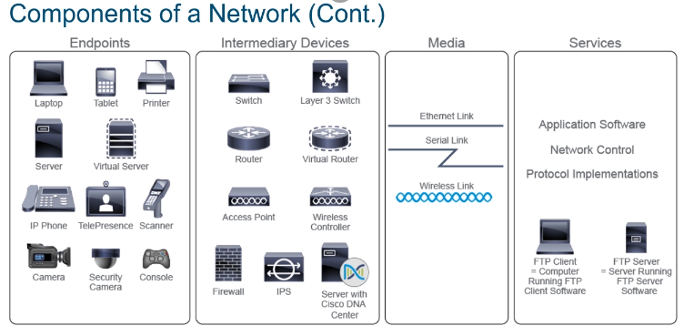

## What is a Computer Network?
- A network is a system of connected elements that operate together
- A network connects devices such as PCs, printers, servers, phones, cameras etc and allows these devices to exchange data with each other
- LAN (Local Area Network) These are all our devices in close proximity to each other such as routers and switches and end-user devices (Pcs, printers, Phones etc). Example being university campus networks
- WAN (Wide Area Network) Which cover a broad geographic area and are managed by service providers examples being a telecommunication provider's network that interconnects multiple cities and states.
- MAN (Metropolitan area networks) which span a physical area larger than LAN but smaller than WAN for instance a city
- SOHO (Small Office/Home Office) has a small number of devices and uses the internet to connect to a main office
- WLC (Wireless LAN Controllers) used to centralize the management of wireless deployments
  

- End point devices are the devices being connected to the network such as PCs, laptops, Phones, servers, virtual servers etc
- Intermediary Devices include switches and routers
- Media is the way devices are connected to the internet, devices using WIFI connect wirelessly where else others use Ethernet or serial links
- Ethernet links mainly used for within LAN network whereas Serial links are how we connect our LANS to a WAN wide area network
- Users who wish to connect their networks to the internet need to connect through a service provider's access network some ways this is done is using different technologies such as dialup or a broadbands telephony network such as ADSL networks, cable networks, mobile, radio or fiber-optic networks
- Small networks usually have fewer than 10 devices, medium to large networks consisting of tens to hundreds of devices and very large global networks such as the internet which connects thousands of devices across the world
-Medium to large enterprise networks can span multiple locations, Usually they have a main office or an enterprise campus which holds most of the corporate resources and remote sites such as branch offices or home offices SOHO which use the internet or WAN (serial links) to connect back to the main office.
-Branch and home offices usually have their own LAN networks with their own servers but mainly rely on the branch office's resources hence the network connection

-The words internet and web are often used interchangeably, but they do not share the same meaning. The internet is a global network that interconnects many networks and therefore provides a worldwide communication infrastructure. The World Wide Web describes one way to provide and access information over the internet using a web browser. It is a service that relies on connections provided by the internet for its function.

##Protocols
-Protocols are a detailed set of rules that govern successful network communication
-The rules define various situations, methods and behaviors that every communicating device should follow
-Examples of protocols used include the voltage to use for an electrical signal, which messages are allowed in communication, what are the building blocks of the messages etc
-Protocols define how data is transmitted between devices in networks and how it allows the devices to communicate with each other
-A set of documents called RFCs defines the protocols and processes of the internet

[Exploring RFC Standards PDF question sheet](PDFS/Exploring-RFC-Standards.pdf)
