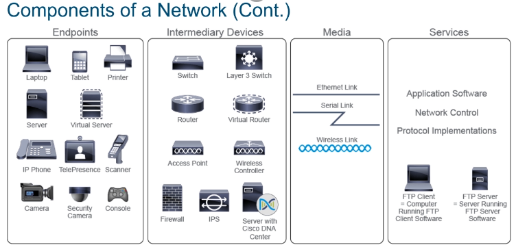
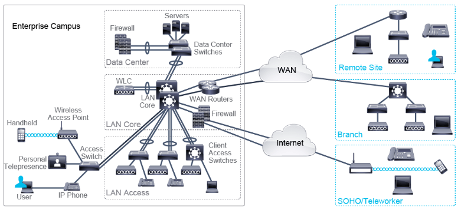
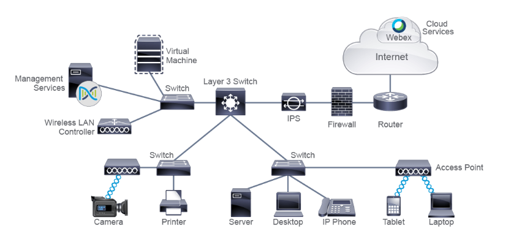
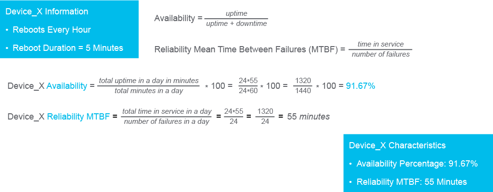

## What is a Computer Network?
- A network is a system of connected elements that operate together
- A network connects devices such as PCs, printers, servers, phones, cameras etc and allows these devices to exchange data with each other
- LAN (Local Area Network) These are all our devices in close proximity to each other such as routers and switches and end-user devices (Pcs, printers, Phones etc). Example being university campus networks
- WAN (Wide Area Network) Which cover a broad geographic area and are managed by service providers examples being a telecommunication provider's network that interconnects multiple cities and states.
- MAN (Metropolitan area networks) which span a physical area larger than LAN but smaller than WAN for instance a city
- SOHO (Small Office/Home Office) has a small number of devices and uses the internet to connect to a main office
- WLC (Wireless LAN Controllers) used to centralize the management of wireless deployments
  

- End point devices are the devices being connected to the network such as PCs, laptops, Phones, servers, virtual servers etc
- Intermediary Devices include switches and routers
- Media is the way devices are connected to the internet, devices using WIFI connect wirelessly where else others use Ethernet or serial links
- Ethernet links mainly used for within LAN network whereas Serial links are how we connect our LANS to a WAN wide area network
- Users who wish to connect their networks to the internet need to connect through a service provider's access network some ways this is done is using different technologies such as dialup or a broadbands telephony network such as ADSL networks, cable networks, mobile, radio or fiber-optic networks
- Small networks usually have fewer than 10 devices, medium to large networks consisting of tens to hundreds of devices and very large global networks such as the internet which connects thousands of devices across the world
-Medium to large enterprise networks can span multiple locations, Usually they have a main office or an enterprise campus which holds most of the corporate resources and remote sites such as branch offices or home offices SOHO which use the internet or WAN (serial links) to connect back to the main office.
-Branch and home offices usually have their own LAN networks with their own servers but mainly rely on the branch office's resources hence the network connection

-The words internet and web are often used interchangeably, but they do not share the same meaning. The internet is a global network that interconnects many networks and therefore provides a worldwide communication infrastructure. The World Wide Web describes one way to provide and access information over the internet using a web browser. It is a service that relies on connections provided by the internet for its function.

## Protocols
-Protocols are a detailed set of rules that govern successful network communication
-The rules define various situations, methods and behaviors that every communicating device should follow
-Examples of protocols used include the voltage to use for an electrical signal, which messages are allowed in communication, what are the building blocks of the messages etc
-Protocols define how data is transmitted between devices in networks and how it allows the devices to communicate with each other
-A set of documents called RFCs defines the protocols and processes of the internet

[Exploring RFC Standards PDF question sheet](PDFS/Exploring-RFC-Standards.pdf)

## Common Usage of Computer Network
- Computer networks are built to communicate, communication methods include:
- Communication before human beings
- Communication between network machines e.g a humidity sensor communicating with a database to send the latest data
- Communication between humans and machines e.g when someone purchases movie tickets online

- When sending data over a network when communicating the data gets transformed into bits to digitalize it and allow it to be sent over the network, the transformation must happen because the rules of communication requires that to happen.

- Over a computer network the communication application and the computer's OS breaks down the large series of bits into smaller groups and prepares them for transmission over the network, once prepared the user's computer transmits them as a digital signal.
- On the path to their destination, the groups of bits encounter different network devices that help them steer and navigate through the network most commonly being a network switch first then onto the network router
- Last step is the data being reassembled in the same order as it was before crossing the computer network. The reason for this is so protocols can convert bits back to original data, that is displayed by the application

EXAMPLE SCENARIO:

In the scenario, the desired destination is Bob’s computer, wherever Bob is located. More specifically, the destination is the chat application on Bob’s computer. For Alice to have a successful, real-time chat with Bob, many things must happen. Bob’s computer has to be powered on, connected to the network, and it must have the chat application running. Also, the complete voyage of the series of bits that Alice’s application created, must happen without issues. The computer network is resilient and the protocols that govern its functioning foresee many issues and provide solutions. All with the goal for the communication to succeed. As evident from our daily activities, network communication is successful most of the time.

## Components of a Network

## Endpoint Devices
- Called end-user devices and include PCS, laptops, mobile phones, game consoles, file servers, printers, cameras, smart home components etc.
- Many end devices are virtualized
-In virtualization one physical device is used to emulate multiple end devices, the emulated computer system operates as a separate physical unit and has its own operating system and other required software using its host's resources. Virtualization is commonly applied to servers to optimize resource utilization because server resources are often underutilized when they are implemented as separate physical units.

## Intermediary devices
- Devices which interconnect end devices or interconnect networks
- Different functions such as regernerating and retransmitting signals, choosing the best path between networks, classifying and forwarding data according to priorities, filtering traffic to allow or deny it based on security settings.
- Intermediary devices can also be virtualized just like end point devices

## Switches
- Allows multiple end points to connect to the network
- Switches allow devices to communicate on the same network
- All devices connected to a single switch can communicate to each other, to communicate to a different network it needs to pass through a router to do so

## Routers
- Device which connects networks and intelligently chooses the best paths between networks
- Main function is to route traffic from one network to another e.g being you need your router to connect your office network to the internet
- Certain switches combine functionalities of routers and switches and they are called Layer 3 switches

## APs (access points)
- APs are nodes on a wireless network that allows other wireless devices to connect to a wired network
- usually connected to a switch as a standalone device but also can be an integral component of the router itself

## WLCs (Wireless LAN controllers)
- Centralized network device which are used by network administrators or operation centers to facilitate the management of many APs
- Automatically manages the configuration of wireless APs

## Cisco Secure Firewalls
- Firewalls are network security systems that monitor and control the incoming and outgoing network traffic based on predetermined security rules
- Establishes a barrier between a trusted, secure internal network and another outside network such as the internet that is assumed to not be trusted

## Intrusion Protection System (IPS)
- IPS is a system that performs a deep analysis of network traffic while searching for signs that behavior is suspicious or malicious
- Can take action immediately if finding a threat
- IPS and Firewall can work in conjunction to defend a network

## Management Services
- A modern management service offers centralized management that facilitates designing, provisioning, and applying policies across a network
- includes features for discovery and management of network inventory, management of software images, device configuration automation, network diagnostics, and policy configuration.
- It provides end-to-end network visibility and uses network insights to optimize the network.
- example of a centralized management service is Cisco Catalyst Center

- In homes you can often find Wireless routers which has characteristics of a switch, a router that enables users to access other networks and the internet and a WLAN AP allowing wireless devices to connect to it.

- A file server is another network device which runs software that implements standardized protocls to support file transfer from one device to another over a network 

## Media
- Media are the physical elements that connect network devices
- Media carry electromagnetic signals that represent data
- Electromagnetic signals can be guided in wires and fiver-optic cables or through wireless transmissions such as WI-FI, mobile or satellite
- Type of media used can be based on a few factors such as budget or the environment used, example being a film crew in the desert might only have access to satellite connected (air medium)
- Wires have connectors on each end which is a plug, the most common type of connector on a LAN is the plug that looks like an analog phone connector, it is called an RJ-45 connector
- Devices use Network Interface Cards NIT to connect devices to a network
- NICs on LANs are called LAN adapters which translate the data created by the device into a format that can be transmitted over the media
- NICs on a LAN are uniquely identified by a MAC address. The MAC address is hardcoded or "burned in" by the NIC manufacturer. NICs used to interface with WANs are called WAN interface cards (WICs), and they use serial links to connect to a WAN network.

## Network Services

- Services in a network comprise software and processes that implement common network applications, such as email and web. These generate data and determine how data is moved through the network
- Companies typically centralize business-critical data and applications into central locations called data centers
- Data centers can include routers, switches, firewalls, storage systems, servers and application delivery controllers.
- Computing resources can also be centralized off-premises in the form of a cloud
- Clouds can be private, public or hybrid and they aggregate the computing, storage, network and application resources in central locations
- Cloud computing resources are configurable and shared among many end users and are transparently available regardless of the user's point of entry
- Data stored by the user is available whenever the user is connected to the cloud

## Topology
- Refers to the arrangement of network elements (devices, links).
- Determines physical connections and logical data flows.
- A well-designed topology optimizes data flow and overall network performance

## Bitrate / Bandwidth
- Bitrate = data rate of a link, measured in bits per second (bps).
- Often called bandwidth or speed in device configs.
- Represents how many bits are transmitted per second—not how fast a single bit travels.
- Transmission speed depends on the physical medium (e.g., copper, fiber).
- Common link speeds:
- 1 Gbps (1 billion bits/sec)
- 10 Gbps
- 100 Gbps (in high-performance networks)

## Availability 
- Measures how often the network is accessible and operational.
- High availability requires:
- Redundant design (backup links, devices, components)
- Fast recovery from failures
- Goal: Minimize downtime and service disruption.

## Reliability
- Indicates how consistently the network performs as expected.
- Focuses on failure-free operation over a defined time period.
- Reliability ≠ Availability:
- A network can be available but not reliable (e.g., degraded performance).
- Reliable networks use high-quality, redundant components to boost both reliability and availability.

## Scalability
- Measures how well a network can grow (users, traffic) without degrading performance.
- A scalable network adapts to increased demand with minimal redesign.
- Designing only for current needs can lead to costly upgrades later.
- Key for future-proofing and long-term efficiency

## Security
- Refers to protection of both:
- Network infrastructure (devices, links)
- Transmitted data (confidentiality, integrity)
- Threats evolve constantly—security must be proactive and adaptive.
- Should be considered in every network-related decision or configuration.
- Includes physical security, access control, encryption, firewalls, etc

## Quality of Service (QoS)
- Set of tools and mechanisms to manage network traffic.
- Prioritizes critical applications during congestion (e.g., VoIP, video).
- Helps ensure consistent performance for latency-sensitive services.
- Can be configured via policies, traffic shaping, and queuing strategies

## Cost
- Covers:
- Initial hardware/software purchases
- Installation and setup
- Ongoing maintenance and upgrades
- Budget constraints often influence design choices and scalability.
- Cost-effective design balances performance, reliability, and future growth

## Virtualization
- Emulates network services/functions in software (vs. traditional hardware).
- Enables centralized management, automation, and provisioning.
- Solves modern challenges like scalability, flexibility, and rapid deployment.
- Examples: virtual switches, routers, firewalls, SDN (Software-Defined Networking)

## Topologies

- Every network has both a physical topology and a logical topology  
- Physical topology refers to the actual layout of devices and cabling in a network  
- The term "node" is commonly used in topology diagrams to represent a device  
- Two networks may share the same physical topology but differ in:  
  - Distance between nodes  
  - Physical interconnections  
  - Transmission rates  
  - Signal types  
- Implementing a physical topology requires using media appropriate to that topology  
- In wired networks, identifying the type of cabling is essential for describing the physical topology  
- Diagrams often illustrate common physical topologies encountered in networking

## Bus Topology

- All workstations are connected to a single cable called the bus or backbone.
- Each device shares the same communication line.
- Earlier setups used coaxial cable with connectors to link devices.
- Signals travel in both directions along the cable.
- Terminators are placed at both ends to prevent signal bounce.

## Ring Topology

- Devices are cabled in succession, forming a closed loop or ring.
- Each device connects to exactly two neighboring devices.
- There is no direct connection to any third device.
- Data sent from one node travels through intermediate nodes until it reaches the destination.
- The ring structure allows data to circulate in one direction (or both, in dual-ring setups).

## Star Topology

- The most common physical topology used in networks
- All devices connect to a central device via point-to-point links
- Also referred to as the hub and spoke topology
- Spoke devices do not have direct physical connections to each other
- Includes both star and extended star topologies
- In an extended star topology:
  - One or more spoke devices are replaced by a device with its own spokes
  - Effectively creates multiple interconnected star topologies

## Mesh Topology

- Devices can be connected to more than one other device
- Multiple paths exist for data to travel between nodes
- Redundant links improve reliability and enable self-healing
- In a full mesh topology:
  - Every node is connected to every other node
- In a partial mesh topology:
  - Some nodes are not connected to all other nodes

## Logical Topologies

- The logical topology is the path which data travels from one point in the network to another.
- The logical topology requires data to also travel through the router for the two devices to communicate. hence in the example why the data does not take the shortest path theough both switches
- Same is true for all other end devices
- Logical topology would then be a star, where the router is a central device

## Logical vs Physical Topology

- Logical and physical topologies can be the same, but often differ
- Physical topology refers to the actual layout of devices and cabling
- Logical topology describes how data flows through the network

- Example: Ethernet hub
  - Devices connect in a physical star layout
  - The hub copies signals from one port to all others
  - Data is received by all nodes, behaving like a bus topology
  - Therefore, the logical topology is a bus

- Logical topology is influenced by:
  - Intermediary devices (e.g. hubs, switches, routers)
  - Network protocols used

- Example: Ethernet switch
  - Devices connect in a physical star layout
  - Data is sent only to the intended destination
  - Both physical and logical topologies are star

- Switch-based star topology is the most common LAN implementation today

## Interpreting a Network Diagram

- Network diagrams are visual tools used to understand network design and operation
- They serve as maps that show devices and their interconnections
- Diagrams can represent both physical and logical aspects of a network
- Multiple diagrams may be used depending on the level of detail required

- Common types of network diagrams:
  - Physical diagrams: show actual device placement and cabling
  - Logical diagrams: show data flow and logical relationships
  - Sequence diagrams: illustrate the chronological exchange of messages between devices

- Diagrams typically use icons to represent devices and media
- Additional information may be included, such as device names and models

## Port and Slot Naming Conventions

- Format: slot#/port#
  - Example: Te1/4 → Port 4 in slot 1

- Format: slot#/sub-slot#/port#
  - Example: G1/2/1 → Port 1 in slot 1, sub-slot 2

- A slot is typically an opening in a router or switch that allows installation of a module
- Some switches are fixed-port and do not have modular slots
  - All ports are assigned to the default built-in slot: slot 0

- Some modules include smaller divisions called sub-slots
  - Sub-slots help organize ports on complex or multi-function modules

## Interface Naming Reference

- Ethernet  
  - Abbreviation: E  
  - Example: E0/0  

- FastEthernet  
  - Abbreviation: Fa  
  - Example: Fa0/1  

- GigabitEthernet  
  - Abbreviation: Gi  
  - Example: Gi1/0/1  

- TenGigabitEthernet  
  - Abbreviation: Te  
  - Example: Te1/5  

- FortyGigabitEthernet  
  - Abbreviation: Fo  
  - Example: Fo1/0/1  

- HundredGigabitEthernet  
  - Abbreviation: Hu  
  - Example: Hu1/0/2  

- Note:  
  - In some cases, the first interface in a slot or sub-slot is numbered as 0 instead of 1

## User Applications on the Network

- Network traffic can be generated by end users or by control mechanisms
- User-generated traffic comes from applications in use
- Control traffic is generated by intermediary devices or network management activities

- Applications vary in the type and characteristics of traffic they produce
- Application usage can impact overall network performance
- Network performance also affects how applications behave and respond

- Usage reflects the user's perception of service quality (good or bad experience)
- Quality of Service (QoS) is used to prioritize traffic and improve user experience

## Application Traffic Classification Characteristics

- Interactivity  
  - Applications can be interactive or noninteractive  
  - Interactive apps expect a response for normal operation  
  - Sensitivity to delay varies across applications  

- Real-time responsiveness  
  - Real-time apps require timely data delivery  
  - Not all real-time apps are interactive  
  - Examples: live video streaming, video conferencing  
  - Delay (latency) is the time from source to destination  
  - Latency includes propagation and processing delays  
  - Jitter is the variation in latency during data exchange  

- Amount of data generated  
  - Voice apps produce low data and are bandwidth benign  
  - Video streaming apps generate high traffic and are bandwidth greedy  

- Burstiness  
  - Smooth/nonbursty apps generate consistent data  
  - Bursty apps vary in data output depending on activity  
  - Example: web browsing (light vs heavy content download)  

- Drop sensitivity  
  - Packet loss can degrade application performance  
  - Real-time apps like video on demand are drop-sensitive  

- Criticality to business  
  - Importance is subjective and context-dependent  
  - Example: video surveillance may be critical for one enterprise, irrelevant for another

## Application Types

### Batch Applications

- Used for sending and receiving files (e.g. FTP, TFTP)
- User selects files and initiates transfer; no further interaction required
- Bandwidth affects speed but is not critical — transfer completes eventually
- Characteristics:
  - Typically do not require direct human interaction
  - Bandwidth is important but not critical
  - Examples: FTP, TFTP, inventory updates

### Interactive Applications

- Require user interaction and wait for responses
- Response time is more important than in batch applications
- Bandwidth guarantees are not always necessary
- Transactions may take longer if bandwidth is limited, but still complete
- Characteristics:
  - Typically support human-to-machine interaction
  - Acceptable response times vary by business importance
  - Examples: database inquiry, stock exchange transaction

### Real-Time Applications

- Include voice and video applications, often with human interaction
- Bandwidth is critical due to high data volume and time sensitivity
- Delay (latency) can disrupt functionality
- Lost data is not retransmitted — packet loss impacts performance
- QoS is required to prioritize and protect real-time traffic
- Characteristics:
  - Typically support human-to-human interaction
  - End-to-end latency is critical
  - Examples: voice applications, video conferencing, live sports streaming

## Communication Models and Protocols

### Overview

- Communication models help organize the complexity of internetworking
- Two commonly used models:
  - ISO OSI (Open Systems Interconnection)
  - TCP/IP (Transmission Control Protocol / Internet Protocol)
- Both models describe internetworking functions and define protocols

### ISO OSI vs TCP/IP

- TCP/IP protocols are widely implemented in modern networking
- ISO OSI is a general reference model used for comparison and guidance across systems
- ISO OSI is often used in education and troubleshooting due to its layered clarity

### Benefits of Standards-Based Layered Models

- Make complexity manageable by dividing tasks into functional layers
- Define communication tasks to standardize development across vendors
- Enable modular engineering for hardware/software interoperability
- Prevent changes in one layer from affecting others
- Support evolution and updates without rewriting entire protocols
- Simplify teaching and learning of networking concepts

- Note:  
  - Understanding layers helps narrow down issues during troubleshooting

### Evolution of Networking

- Early networks focused solely on data transfer
- Data referred to electronic information processed by computers
- Different protocols (IP, AppleTalk, Token Ring, FDDI) required unique hardware and topologies
- Telephone networks operated separately with distinct standards and equipment
- Over time, IP became the dominant standard for data communication
- Networking expanded to include voice and video, leading to converged networking

### Converged Networking

- Converged networks use a unified set of protocols for voice, video, and data
- Industrial environments also adopted converged networking
- Operational Technology (OT) managed automation and control systems
- IT managed business applications; both operated independently
- With industrial IoT, OT and IT now collaborate to make plant data actionable
- Factory Networks connect automation systems with IT systems using standard networking
- Benefits include:
  - Real-time access to mission-critical data
  - Enterprise-wide knowledge sharing
  - Improved safety and operational effectiveness

### Layers and Protocols

- Both ISO OSI and TCP/IP models use layers to group networking tasks
- Each layer performs specific functions and interacts with adjacent layers (vertical communication)
- Layers at source and destination communicate directly (horizontal communication)

### Protocols

- Protocols are grouped by layers and form protocol suites
- TCP/IP is an example of a protocol suite
- A protocol defines rules for a specific type of communication
- Successful communication requires all devices to follow the same protocol rules

## ISO OSI Model and Communication Standards

### Background and Purpose

- ISO created the OSI model to address network interoperability challenges
- The OSI model serves as a framework for building protocol suites
- Goal: enable international networking without relying on proprietary systems
- Proprietary systems are vendor-specific and often incompatible with others
- TCP/IP was used in early network implementations and became the practical standard
- TCP/IP replaced the OSI protocol suite in real-world deployments

- Note:  
  - ISO (International Organization for Standardization) is an independent, non-governmental body  
  - It develops voluntary international standards to improve productivity and reduce errors

### OSI Model Overview

- Describes how data is transferred across a network
- Covers both hardware and software aspects of transmission
- Defines functions and services at each layer
- Facilitates understanding of data flow and supports vendor interoperability
- Used in network design, operation specs, and troubleshooting

### Layer Grouping

- Upper layers (5–7): focus on user interaction and data presentation
- Lower layers (1–4): focus on data transport across the network

### OSI Model: 7 Layers

#### Layer 1: Physical Layer

- Defines electrical, mechanical, procedural, and functional specs for physical links
- Handles electromagnetic representation and transmission of bits
- Specifies line encoding, voltage levels, timing, data rates, connectors, and distances
- Implemented solely in hardware

#### Layer 2: Data Link Layer

- Formats data for transmission and controls access to physical media
- Includes error detection and correction for reliable delivery
- Manages NIC-to-NIC communication within the same subnet
- Uses physical (MAC) addresses to identify hosts

#### Layer 3: Network Layer

- Provides connectivity and path selection beyond the local segment
- Uses logical addressing to identify sender and recipient
- Logical addresses differ from postal addresses but serve similar identification roles
- Ensures unique identification of hosts for communication

#### Layer 4: Transport Layer

- Segments and reassembles data for multiple communications
- Manages flow control and reliability mechanisms
- Uses local addressing to distinguish between application processes
- Supports reliable or unreliable transport depending on application needs

#### Layer 5: Session Layer

- Establishes, manages, and terminates sessions between hosts
- Handles dialog control (one-way or two-way communication)
- Manages checkpoints and recovery
- Used in applications with remote procedure calls

#### Layer 6: Presentation Layer

- Ensures data is readable by the receiving application layer
- Translates data into standard formats
- Handles compression/decompression and encryption/decryption
- May perform some functions at lower layers as well

#### Layer 7: Application Layer

- Closest layer to the user
- Provides services to user applications (e.g. email, file transfer, terminal emulation)
- Protocols at this layer support user-facing tasks
- Operating systems may use this layer for remote file access or data import
- Does not provide services to other OSI layers

# TCP/IP Model – Core Notes for CCNA

## Overview

- TCP/IP is the protocol suite used in real-world networking.
- It predates the OSI model and was designed for practical implementation.
- The model has 4 layers (sometimes shown as 5), each handling specific networking tasks.
- Unlike OSI, TCP/IP protocols are widely adopted and standardized across devices and platforms.

## TCP/IP vs OSI Layer Mapping

| TCP/IP Layer        | OSI Equivalent Layers             |
|---------------------|-----------------------------------|
| Application         | Application, Presentation, Session |
| Transport           | Transport                          |
| Internet            | Network                            |
| Network Access      | Data Link, Physical                |

## Key Concepts

- **Encapsulation**: Data is wrapped with headers as it moves down the layers.
- **De-encapsulation**: Headers are stripped as data moves up the layers on the receiving side.
- **IP addresses**: Used for global routing across networks.
- **MAC addresses**: Used for local delivery within a LAN.
- **ARP**: Resolves IP addresses to MAC addresses for local transmission.

## Protocol Cheat Sheet

### Application Layer  
User-facing services and data formatting  
- HTTP / HTTPS – Web browsing  
- FTP / TFTP – File transfers  
- SMTP / POP3 / IMAP – Email  
- DNS – Domain name resolution  
- DHCP – Dynamic IP assignment  
- SNMP – Network monitoring  

### Transport Layer  
Segmentation, reliability, and flow control  
- TCP – Reliable, ordered delivery  
- UDP – Fast, connectionless delivery  

### Internet Layer  
Routing and logical addressing  
- IP (IPv4 / IPv6) – Core addressing and routing  
- ICMP – Diagnostics (e.g. ping)  
- ARP – IP to MAC resolution  
- RARP – MAC to IP (rarely used)  

### Network Access Layer  
Local delivery and physical transmission  
- Ethernet – LAN protocol  
- Wi-Fi (802.11) – Wireless LAN  
- PPP – Point-to-point links  
- Frame Relay / ATM – Legacy WAN protocols

## Use Cases

- Web browsing, email, gaming, VoIP, industrial IoT, and more
- TCP/IP powers all modern internet and enterprise communication
- Layered troubleshooting helps isolate issues (e.g. DNS failure = Application layer)

# Layered Communication & Peer-to-Peer Concepts – CCNA Notes

## Peer-to-Peer Communication (Horizontal)

- "Peer" means equal — in networking, layers communicate with their counterpart layer on the receiving host.
- This is called horizontal communication:
  - Application layer on one device talks to the application layer on another.
  - Transport layer talks to transport layer, and so on.
- Each layer only interacts directly with the layer above and below it locally, but its output is meant for its peer on the other side.

## Vertical Communication

- Data moves down the stack when sending and up the stack when receiving.
- This is called vertical communication.
- Each layer adds or removes headers as data moves through the stack.

## Logical Communication

- Except for the physical layer, all layers are implemented in software.
- Devices don’t directly connect layer-to-layer — they simulate communication through protocols.
- This is called logical communication — it behaves like direct interaction, even though it’s not.

## Application Architectures

- Peer-to-peer (P2P): Tasks and workloads are equally distributed among devices (e.g. BitTorrent).
- Client-server: Tasks are divided unequally — clients request, servers respond (e.g. web browsing).

## Protocol Data Units (PDUs)

As data moves through the stack, its name changes:

| Layer       | PDU Name |
|-------------|----------|
| Application | Data     |
| Transport   | Segment  |
| Internet    | Packet   |
| Link        | Frame    |

- PDU = Protocol Data Unit — a generic term for any data unit at any layer.
- Each layer wraps the data with its own header before passing it down.

# Encapsulation & De-Encapsulation – CCNA Notes

## What Is Encapsulation?

- Encapsulation is the process of wrapping user data with protocol-specific headers (and sometimes trailers) as it moves **down the stack**.
- Each layer adds its own control information to help its peer layer on the receiving side interpret the data.
- This supports **horizontal communication** between matching layers across devices.

## What Is De-Encapsulation?

- De-encapsulation is the reverse process — each layer **removes its header/trailer** as data moves **up the stack** on the receiving device.
- Each layer uses the header info to perform its function before passing the data upward.

## Encapsulation Process (Sending Side)

| Layer       | Action                                                                 | PDU Name |
|-------------|------------------------------------------------------------------------|----------|
| Application | Adds application header                                                | Data     |
| Transport   | Adds transport header (e.g. TCP/UDP)                                   | Segment  |
| Internet    | Adds IP header                                                         | Packet   |
| Link        | Adds frame header + trailer (e.g. MAC + FCS)                           | Frame    |
| Physical    | Converts frame to signals for transmission                             | Bits     |

- Each layer nests the data like boxes within boxes.
- The Link layer trailer often includes error-checking info (e.g. Frame Check Sequence).
- Encapsulation increases PDU size — this added info is called **overhead**.

## De-Encapsulation Process (Receiving Side)

| Layer       | Action                                                                 |
|-------------|------------------------------------------------------------------------|
| Link        | Checks frame integrity, removes header/trailer, passes packet upward   |
| Internet    | Reads IP header, removes it, passes segment upward                     |
| Transport   | Reads transport header, removes it, passes data to correct app layer   |
| Application | Processes data and delivers it to the user application                 |

- Each layer only processes its own header/trailer.
- Devices like switches only process **Link layer** frames.
- Routers process **Internet layer** packets and may inspect deeper (Transport layer).
- Hosts perform both encapsulation and de-encapsulation simultaneously during communication.

## Notes

- Encapsulation = sending; De-encapsulation = receiving.
- Both TCP/IP and OSI models describe this process — terminology may vary, but the concept is universal.
