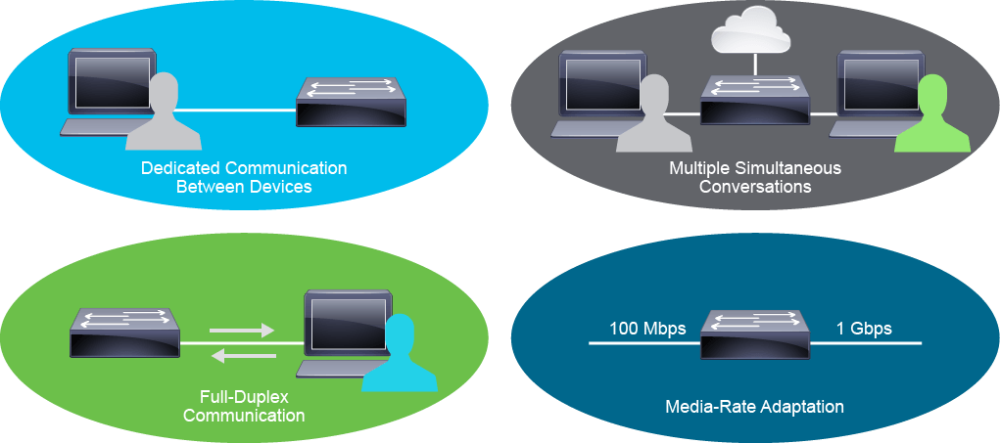

# LAN vs WAN — Networking Fundamentals

## What Is a LAN?

A Local Area Network (LAN) is a network of endpoints and components located within a limited geographic area. This could be a home office, a small business, or a larger corporate building or campus.

### Key Characteristics:
- Owned and managed by the organization or individual
- High data transfer rates
- No need for leased telecom lines
- Infrastructure includes cabling, switches, and endpoints

### LAN Size Examples:
- Small LAN: 2 computers in a home office
- Large LAN: Hundreds of devices across multiple buildings

## What Is a WAN?

A Wide Area Network (WAN) connects multiple LANs across large geographic areas. WANs use infrastructure provided by ISPs or telecom carriers to link remote users, external services, and different organizational sites.

### Key Characteristics:
- Uses leased lines or carrier services
- Connects multiple locations and external networks
- Supports voice, data, and video traffic
- Typically lower data rates than LANs

## LAN vs WAN Comparison

| Feature           | LAN                              | WAN                                 |
|------------------|-----------------------------------|-------------------------------------|
| Scope            | Local (building/campus/home)      | Wide (city, country, global)        |
| Ownership        | Private                           | Carrier-managed                     |
| Speed            | High                              | Variable                            |
| Infrastructure   | Internal cabling and switches     | Leased lines, routers, carrier gear |
| Cost             | Lower                             | Higher                              |

# LAN Components and Functions

## Early LANs

Initial LANs primarily connected:
- PCs
- File servers
- Print servers
- Legacy devices like hubs and bridges

Hubs and bridges have since been replaced by switches and are no longer used.

## Modern LANs

A typical small office LAN may include:
- Routers
- Switches
- Access Points (APs)
- Servers
- IP phones
- Mobile phones
- PCs and laptops

## Fundamental LAN Components

### Hosts
Devices that send or receive data on the LAN. Also referred to as endpoints.

### Interconnections
Enable data movement across the network. Include:

- **Network Interface Cards (NICs)**: Convert device data into frame format for LAN transmission over copper, fiber, or wireless.
- **Network Media**: Traditionally copper and fiber-optic cables; now often includes wireless LAN (WLAN).

### Network Devices
Responsible for data delivery between hosts.

- **Ethernet Switches**: Operate at OSI Layer 2. Aggregate LAN traffic and intelligently forward frames.
- **Routers**: Operate at OSI Layer 3. Connect LAN segments and provide internet access.
- **Access Points (APs)**: Operate at OSI Layer 2. Provide wireless connectivity.

### Protocols
Rules for data transmission across the LAN. Common protocols include:
- Ethernet (IEEE 802.2, 802.3)
- IP
- TCP
- UDP
- ARP (IPv4) / NDP (IPv6)
- CIFS
- DHCP

## Functions of a LAN

- **Data and Applications**: Share files and software across users for collaboration.
- **Resources**: Share input/output devices like cameras and printers.
- **Communication Path**: Connect to external networks via a gateway when local resources are unavailable.

# Switches and Collision Domains

## Network Segments and Legacy Devices

When connecting three or more devices, a dedicated network device is needed to manage communication. Switches were introduced to divide a LAN into segments.

- A **segment** is a single, unbroken network cable connection.
- Ethernet segments are limited in physical distance.

Historically, devices were connected using **hubs**, which are Layer 1 devices that act as simple repeaters. All devices shared the same media, forming a single **collision domain**.

### Collision Domains
- A collision domain is a shared medium where multiple devices compete to transmit data.
- Only one device can transmit at a time; others must wait.
- Collisions reduce efficiency and increase retransmission delays.
- Bandwidth is shared across all devices.

## Role of Switches

Modern switches operate at the **link layer (Layer 2)** and divide a LAN into multiple segments. Each switch port connects to a single device, creating a **collision-free domain** per port.

### Switch Features
- Operate at the link layer of the TCP/IP suite
- Selectively forward individual frames
- Provide many ports to segment large LANs
- Support various port speeds
- Buffer frames to prevent drops during congestion

By default, all interconnected switches belong to a single LAN.

## Causes of Network Congestion

Switches help mitigate common causes of congestion:
- Faster computers and peripherals generating more data
- Increased volume of network traffic from remote resources
- High-bandwidth applications (e.g., video streaming, e-learning, engineering design)

## Frame Forwarding

Switches buffer incoming frames, process them, and forward them to the correct destination port. This selective forwarding improves efficiency and reduces unnecessary traffic.

# LAN Switches — Functions and Characteristics

## Purpose of LAN Switches

LAN switches are essential for modern networks. They help alleviate network congestion by increasing effective bandwidth and segmenting traffic intelligently.

## Key Functions of Switches

### Dedicated Communication
Each device connected to its own switch port receives full bandwidth. This microsegmentation eliminates collisions and improves throughput.

### Multiple Simultaneous Conversations
Switches can forward multiple frames between different port pairs at the same time. I/O buffers and fast internal transfer speeds enable nonblocking performance.

### Full-Duplex Communication
Once microsegmented, a switch and host can send and receive data simultaneously. A 100 Mbps full-duplex link provides 100 Mbps in both directions, totaling 200 Mbps effective capacity. Duplex mode is auto-negotiated during link setup.

### Media-Rate Adaptation
Switches support various port speeds (e.g., 10/100/1000 Mbps, 1/10/25/40/100 Gbps), allowing flexible bandwidth allocation across different devices.

## Characteristics of LAN Switches

- **High Port Density**: Common models include 24-, 32-, and 48-port switches. Enterprise switches may support hundreds of ports.
- **Large Frame Buffers**: Useful for handling congestion, especially on ports connected to servers or high-traffic areas.
- **Port Speed Flexibility**: Supports a range of speeds from 100 Mbps to 100 Gbps.
- **Fast Internal Switching**: Enables high-throughput performance across all ports.
- **Low Per-Port Cost**: High density at lower cost allows for more granular segmentation and better bandwidth per user.

## ASICs in Switches

Switches rely on Application-Specific Integrated Circuits (ASICs) for efficient traffic handling. ASICs are optimized for packet switching and routing, unlike general-purpose CPUs which are slower at managing large memory lookups and forwarding decisions.
