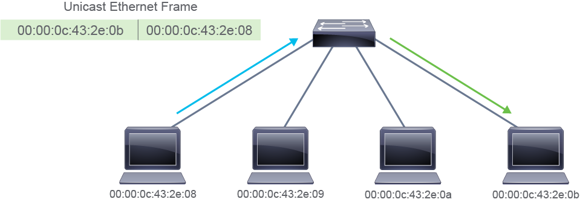
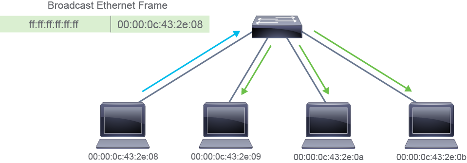

# LAN vs WAN — Networking Fundamentals

## What Is a LAN?

A Local Area Network (LAN) is a network of endpoints and components located within a limited geographic area. This could be a home office, a small business, or a larger corporate building or campus.

### Key Characteristics:
- Owned and managed by the organization or individual
- High data transfer rates
- No need for leased telecom lines
- Infrastructure includes cabling, switches, and endpoints

### LAN Size Examples:
- Small LAN: 2 computers in a home office
- Large LAN: Hundreds of devices across multiple buildings

## What Is a WAN?

A Wide Area Network (WAN) connects multiple LANs across large geographic areas. WANs use infrastructure provided by ISPs or telecom carriers to link remote users, external services, and different organizational sites.

### Key Characteristics:
- Uses leased lines or carrier services
- Connects multiple locations and external networks
- Supports voice, data, and video traffic
- Typically lower data rates than LANs

## LAN vs WAN Comparison

| Feature           | LAN                              | WAN                                 |
|------------------|-----------------------------------|-------------------------------------|
| Scope            | Local (building/campus/home)      | Wide (city, country, global)        |
| Ownership        | Private                           | Carrier-managed                     |
| Speed            | High                              | Variable                            |
| Infrastructure   | Internal cabling and switches     | Leased lines, routers, carrier gear |
| Cost             | Lower                             | Higher                              |

# LAN Components and Functions

## Early LANs

Initial LANs primarily connected:
- PCs
- File servers
- Print servers
- Legacy devices like hubs and bridges

Hubs and bridges have since been replaced by switches and are no longer used.

## Modern LANs

A typical small office LAN may include:
- Routers
- Switches
- Access Points (APs)
- Servers
- IP phones
- Mobile phones
- PCs and laptops

## Fundamental LAN Components

### Hosts
Devices that send or receive data on the LAN. Also referred to as endpoints.

### Interconnections
Enable data movement across the network. Include:

- **Network Interface Cards (NICs)**: Convert device data into frame format for LAN transmission over copper, fiber, or wireless.
- **Network Media**: Traditionally copper and fiber-optic cables; now often includes wireless LAN (WLAN).

### Network Devices
Responsible for data delivery between hosts.

- **Ethernet Switches**: Operate at OSI Layer 2. Aggregate LAN traffic and intelligently forward frames.
- **Routers**: Operate at OSI Layer 3. Connect LAN segments and provide internet access.
- **Access Points (APs)**: Operate at OSI Layer 2. Provide wireless connectivity.

### Protocols
Rules for data transmission across the LAN. Common protocols include:
- Ethernet (IEEE 802.2, 802.3)
- IP
- TCP
- UDP
- ARP (IPv4) / NDP (IPv6)
- CIFS
- DHCP

## Functions of a LAN

- **Data and Applications**: Share files and software across users for collaboration.
- **Resources**: Share input/output devices like cameras and printers.
- **Communication Path**: Connect to external networks via a gateway when local resources are unavailable.

# Switches and Collision Domains

## Network Segments and Legacy Devices

When connecting three or more devices, a dedicated network device is needed to manage communication. Switches were introduced to divide a LAN into segments.

- A **segment** is a single, unbroken network cable connection.
- Ethernet segments are limited in physical distance.

Historically, devices were connected using **hubs**, which are Layer 1 devices that act as simple repeaters. All devices shared the same media, forming a single **collision domain**.

### Collision Domains
- A collision domain is a shared medium where multiple devices compete to transmit data.
- Only one device can transmit at a time; others must wait.
- Collisions reduce efficiency and increase retransmission delays.
- Bandwidth is shared across all devices.

## Role of Switches

Modern switches operate at the **link layer (Layer 2)** and divide a LAN into multiple segments. Each switch port connects to a single device, creating a **collision-free domain** per port.

### Switch Features
- Operate at the link layer of the TCP/IP suite
- Selectively forward individual frames
- Provide many ports to segment large LANs
- Support various port speeds
- Buffer frames to prevent drops during congestion

By default, all interconnected switches belong to a single LAN.

## Causes of Network Congestion

Switches help mitigate common causes of congestion:
- Faster computers and peripherals generating more data
- Increased volume of network traffic from remote resources
- High-bandwidth applications (e.g., video streaming, e-learning, engineering design)

## Frame Forwarding

Switches buffer incoming frames, process them, and forward them to the correct destination port. This selective forwarding improves efficiency and reduces unnecessary traffic.

# LAN Switches — Functions and Characteristics

## Purpose of LAN Switches

LAN switches are essential for modern networks. They help alleviate network congestion by increasing effective bandwidth and segmenting traffic intelligently.

## Key Functions of Switches

### Dedicated Communication
Each device connected to its own switch port receives full bandwidth. This microsegmentation eliminates collisions and improves throughput.

### Multiple Simultaneous Conversations
Switches can forward multiple frames between different port pairs at the same time. I/O buffers and fast internal transfer speeds enable nonblocking performance.

### Full-Duplex Communication
Once microsegmented, a switch and host can send and receive data simultaneously. A 100 Mbps full-duplex link provides 100 Mbps in both directions, totaling 200 Mbps effective capacity. Duplex mode is auto-negotiated during link setup.

### Media-Rate Adaptation
Switches support various port speeds (e.g., 10/100/1000 Mbps, 1/10/25/40/100 Gbps), allowing flexible bandwidth allocation across different devices.

## Characteristics of LAN Switches

- **High Port Density**: Common models include 24-, 32-, and 48-port switches. Enterprise switches may support hundreds of ports.
- **Large Frame Buffers**: Useful for handling congestion, especially on ports connected to servers or high-traffic areas.
- **Port Speed Flexibility**: Supports a range of speeds from 100 Mbps to 100 Gbps.
- **Fast Internal Switching**: Enables high-throughput performance across all ports.
- **Low Per-Port Cost**: High density at lower cost allows for more granular segmentation and better bandwidth per user.

## ASICs in Switches

Switches rely on Application-Specific Integrated Circuits (ASICs) for efficient traffic handling. ASICs are optimized for packet switching and routing, unlike general-purpose CPUs which are slower at managing large memory lookups and forwarding decisions.

# Ethernet Media and Cabling Standards

## Understanding Ethernet Standard Naming

Example: `1000BASE-T`

- **1000**: Transmission speed of 1000 Mbps (1 Gbps)
- **BASE**: Baseband signaling (only Ethernet signals on the medium)
- **T**: Twisted-pair cabling

Twisted-pair cabling uses two conductors twisted together to cancel electromagnetic interference (EMI).

---

## Ethernet Media Standards

| Standard       | Media                                | Max Segment Length                     | Connector Type               |
|----------------|---------------------------------------|----------------------------------------|------------------------------|
| 100BASE-TX     | TIA Category 5 UTP (2-pair)           | 100 m (328 ft)                          | ISO 8877 (RJ-45)             |
| 100BASE-FX     | 62.5/125-micron multimode fiber       | 400 m (1312.3 ft)                       | Duplex MIC, ST               |
| 1000BASE-T     | TIA Category 5/5e UTP (4-pair)        | 100 m (328 ft)                          | ISO 8877 (RJ-45)             |
| 1000BASE-SX    | 62.5/50-micron multimode fiber        | 275 m (62.5 µm), 550 m (50 µm)          | Optical fiber connector      |
| 1000BASE-LX    | 9-micron single-mode fiber            | 5–10 km (1.86–6.2 miles)                | Optical fiber connector      |

**Abbreviations**:
- TIA: Telecommunications Industry Association  
- UTP: Unshielded Twisted Pair  
- ISO: International Organization for Standardization  
- RJ: Registered Jack  

---

## Physical Media Types

- **Coaxial** (legacy, no longer used)
- **Twisted-pair copper**
- **Fiber optics**

Ethernet originally used shared coaxial cable. Today, devices connect via electrical or optical media using various connectors:

### Common Optical Connectors
- LC (Lucent Connector)
- SC (Standard Connector)
- MTP (Multi-fiber Termination Push-on)
- ST (Straight Tip)
- FC (Ferrule Connector — common in service provider gear)

---

## Signal Transmission

### Optical Transmission
- Transmitter converts electrical signal → optical signal
- Fiber optic cable carries optical signal
- Receiver converts optical signal → electrical signal

**Simplified Encoding**:
- `1` = light on  
- `0` = light off  

### Electrical Transmission
- `1` = +10 V  
- `0` = –10 V  

Both signal types suffer from **attenuation** and **noise**, limiting segment length.

---

## Electrical Noise Sources

- **Artificial**: Poor patch cables, electric motors, switching gear, fluorescent lamps
- **Industrial**: Automobiles, airplanes, high-voltage lines
- **Natural**: Lightning (solar noise), cosmic noise from stars

---

# Copper Media — UTP Cabling

Most Ethernet networks use **Unshielded Twisted-Pair (UTP)** copper cabling for short/medium distances due to low cost.

### UTP Characteristics

| Characteristic         | Value                          |
|------------------------|--------------------------------|
| Speed and throughput   | 10 Mbps to 40 Gbps             |
| Cost per node          | Least expensive                |
| Media/connector size   | Small                          |
| Max cable length       | 100 m (30 m for 40 Gbps)       |

### UTP Categories

- **Cat 5**: Up to 100 Mbps  
- **Cat 5e**: Up to 1 Gbps  
- **Cat 6**: Up to 10 Gbps  
- **Cat 6a**: Up to 10 Gbps  
- **Cat 7**: Up to 10 Gbps  
- **Cat 8**: Up to 40 Gbps  

---

## RJ-45 Connector and Jack

- **RJ-45 Plug**: Male, crimped to cable end  
- **RJ-45 Jack**: Female, found on devices, walls, patch panels  

**Pin Numbering**:
- Plug: Pins 8 (left) to 1 (right)  
- Jack: Pins 1 (left) to 8 (right)

---

## Structured Cabling

- Installed during building construction
- Horizontal cabling: Wall socket → wiring closet  
- Vertical cabling: Between wiring closets

---

# Power over Ethernet (PoE)

PoE delivers **data + power** over Ethernet cables to devices like:
- Wireless APs
- IP cameras
- VoIP phones

Uses all four pairs in Cat 5 or higher cables.

---

# Straight-Through vs Crossover Cables

### Straight-Through
- Connects **unlike** devices (e.g., PC to switch)

### Crossover
- Connects **like** devices (e.g., PC to PC, switch to switch)

### How to Identify
- Hold both ends side by side
- If pin colors match → straight-through  
- If wires cross → crossover

### Auto-MDIX
Modern devices support **auto-MDIX**, which auto-detects cable type and adjusts internally. Either cable type can be used.

# Optical Fiber — Media, Types, and Connectors

## What Is Optical Fiber?

An optical fiber is a flexible, transparent strand made of highly pure glass (silica), slightly thicker than a human hair. It acts as a waveguide to transmit light between two endpoints.

### Advantages
- Supports long-distance, high-bandwidth communication
- Less signal loss compared to metal wires
- Immune to electromagnetic interference (EMI)

### Structure
- **Core**: Carries the light signal
- **Cladding**: Surrounds the core and confines the light
- **Buffer (Coating)**: Protects the fiber from scratches and moisture

Typical dimensions:
- Core diameter: ~9 µm (varies by type)
- Cladding diameter: 125 µm (standardized)

---

## Fiber Types — MMF vs SMF

| Characteristic           | Multimode Fiber (MMF)         | Single-Mode Fiber (SMF)             |
|--------------------------|-------------------------------|-------------------------------------|
| Light Source             | LED                           | Laser                               |
| Bandwidth & Speed        | Lower                         | Higher                              |
| Transmission Distance    | Shorter                       | Longer                              |
| Cost                     | Less expensive                | More expensive                      |
| Core Size                | Larger                        | Smaller                             |
| Modes of Transmission    | Multiple paths (modes)        | Single path (approximation)         |

- MMF is used for short-distance links (e.g., within buildings)
- SMF is used for long-distance, high-speed links (e.g., between campuses)

---

## Fiber Connector Types

Fiber connectors terminate the ends of optical fibers. Over 70 types exist, but most organizations standardize based on equipment or fiber type.

### Locking Mechanisms
- **Threaded**: Screws into place
- **Bayonet**: Twist-and-lock
- **Push-pull**: Snap-in

### Materials
- Metal
- Plastic sleeve

### Common Connector Types

| Connector | Typical Use                                      |
|-----------|--------------------------------------------------|
| LC        | Enterprise gear, SFP modules                     |
| SC        | Enterprise gear                                  |
| ST        | Patch panels (durability)                        |
| FC        | Service provider patch panels                    |
| MT-RJ     | Two-fiber connector, enterprise equipment        |

Small Form Factor (SFF) connectors like LC are replacing larger connectors like SC to reduce footprint and increase port density.

---

## SFP and SFP+ Transceivers

| Transceiver Type     | Max Speed     | Supported Mediums       |
|----------------------|---------------|--------------------------|
| 1000BASE SFP         | 1 Gbps        | Copper / Fiber Optics    |
| 10GBASE SFP+         | 10 Gbps       | Copper / Fiber Optics    |
| 25GBASE SFP28        | 25 Gbps       | Copper / Fiber Optics    |
| 40GBASE QSFP         | 40 Gbps       | Copper / Fiber Optics    |
| 100GBASE QSFP        | 100 Gbps      | Copper / Fiber Optics    |
| 400GBASE QSFP-DD     | 400 Gbps      | Copper / Fiber Optics    |

# Ethernet Frames — Structure and MTU

## What Is an Ethernet Frame?

An Ethernet frame is the container used to transmit data across a LAN. It includes:
- **Header**: Source and destination info
- **Payload**: The actual data
- **Trailer**: Error-checking info

---

## Ethernet II Frame Format

This is the most common frame type used to carry IP packets.

| Field               | Length (Bytes) | Description                                                                 |
|---------------------|----------------|-----------------------------------------------------------------------------|
| **Preamble**         | 8              | Alternating 1s and 0s for signal synchronization                            |
| **Destination MAC**  | 6              | MAC address of the receiving device                                         |
| **Source MAC**       | 6              | MAC address of the sending device                                           |
| **Type**             | 2              | Ether-Type code identifying the protocol (e.g., IP = `0x0800`, IPv6 = `0x86DD`) |
| **Payload**          | 46–1500        | Network layer data (padded if shorter than 46 bytes)                        |
| **FCS**              | 4              | Frame Check Sequence using CRC for error detection                          |

> **Maximum Transmission Unit (MTU)** = 1500 bytes  
> **Max frame size** = 1518 bytes (excluding preamble)

---

## Payload and MTU Behavior

- If the payload is smaller than 46 bytes, padding is added.
- If the payload needs to exceed 1500 bytes (e.g., for tunneling), options include:
  - **Jumbo frames**: Frames larger than 1518 bytes
  - **MTU reduction**: Shrinking the payload to make room for extra headers

### Example — GRE Tunneling:
- GRE adds 24 bytes of overhead (4 bytes GRE + 20 bytes IP header)
- MTU is reduced to **1476 bytes**

---

## Frame Check Sequence (FCS)

- The FCS field uses **Cyclic Redundancy Check (CRC)** to detect transmission errors.
- If the CRC fails, the frame is discarded.

# Network Communication Types — Unicast, Broadcast, Multicast

## Unicast

Unicast is one-to-one communication:
- A frame is sent from one host to one specific destination.
- Only one sender and one receiver.
- Most common transmission type on LANs and across the internet.

---

## Broadcast

Broadcast is one-to-all communication:
- A frame is sent from one address to **all** other addresses on the LAN.
- One sender, multiple receivers.
- Used for discovery protocols and general announcements (e.g., ARP requests).

---

## Multicast

Multicast is one-to-many (group-based) communication:
- A frame is sent to a **specific group** of devices.
- Only devices that are members of the multicast group receive the data.
- More efficient than broadcast for group communication (e.g., video streaming, conferencing).

---

## Multicast Mechanics

- Multicast uses **special IP and MAC addresses** to identify groups.
- Receivers send **Join messages** to subscribe to a multicast group.
- The source sends packets to the group address — only subscribed receivers accept them.

---

## Multicast Protocols

| Protocol | Role                                                                 |
|----------|----------------------------------------------------------------------|
| **IGMP** | Internet Group Management Protocol — manages group membership on LAN |
| **PIM**  | Protocol-Independent Multicast — builds routing paths across networks |

- **IGMP** handles Join messages and ensures traffic reaches only group members.
- **PIM** sets up multicast distribution trees to route packets from source to receivers.

# MAC Address Formats, Structure, and Types

## Display Formats

MAC addresses can be represented in multiple formats:

- `0000.0c43.2e08` — Cisco-style (dot-separated)
- `00:00:0c:43:2e:08` — Colon-separated (common in Linux/Unix)
- `00-00-0C-43-2E-08` — Dash-separated (common in Windows)

All formats represent the same 48-bit address.

---

## Hexadecimal Overview

- Hexadecimal (hex) is a base-16 numbering system.
- Digits include: `0–9` and `A–F`
- `A = 10`, `F = 15`, etc.
- Each hex digit = 4 bits
- MAC address = 12 hex digits = 48 bits
- Letters can be uppercase or lowercase

---

## MAC Address Structure

| Component                        | Bits | Description                                                                 |
|----------------------------------|------|-----------------------------------------------------------------------------|
| Organizationally Unique Identifier (OUI) | 24   | Identifies the NIC manufacturer (assigned by IEEE)                         |
| Device-specific ID               | 24   | Unique to the device (assigned by the vendor)                              |

### Special Bits in First Octet

- **I/G Bit (Individual/Group)**  
  - 0 = Unicast  
  - 1 = Broadcast or Multicast

- **U/L Bit (Universal/Local)**  
  - 0 = Globally assigned  
  - 1 = Locally modified

---

## MAC Address Types

### Unicast MAC Address

- Identifies one specific NIC
- Used for direct device-to-device communication
- Example: `00:00:0c:43:2e:08`

### Broadcast MAC Address

- Sent to all devices on the LAN
- Format: `FF:FF:FF:FF:FF:FF`
- Used for discovery protocols such as ARP requests

### Multicast MAC Address

- Sent to a group of devices
- Format always starts with: `01:00:5E`
- Last 23 bits are derived from the multicast IP address

---

## Multicast MAC Address Example

Multicast IP: `224.1.1.1`  
- Convert last 23 bits of IP to binary  
- Append to `01:00:5E`  
- Resulting MAC: `01:00:5E:01:01:01` (example)

Only devices that join this multicast group will listen to that MAC address.

# Duplex Communication Modes — Half vs Full

## Half Duplex

Half-duplex communication allows data to flow in only one direction at a time.

### Characteristics:
- Unidirectional data flow
- Legacy connectivity (e.g., hubs)
- May have collision issues

### Collision Handling:
- Uses **CSMA/CD** (Carrier Sense Multiple Access with Collision Detection)
- Devices detect collisions and stop transmitting
- Retransmission occurs after a random delay to avoid repeated collisions

### Analogy:
- Like walkie-talkies — only one person can speak at a time

---

## Full Duplex

Full-duplex communication allows simultaneous sending and receiving of data.

### Characteristics:
- Point-to-point only
- Attached to a dedicated switched port
- Requires full-duplex support on both ends

### Collision Avoidance:
- Collision detection is disabled
- No collisions occur due to separate transmit/receive circuits

### Analogy:
- Like a phone call — both parties can talk and listen at the same time

### Duplex Mismatch:
- Occurs when one device is set to full duplex and the other to half
- Leads to performance issues and potential frame loss

# Duplex Configuration — Commands, Defaults, and Verification

## Duplex Command Options

Use the `duplex` command in interface configuration mode to set duplex mode:

| Command             | Purpose                          |
|---------------------|----------------------------------|
| duplex full         | Set full-duplex mode             |
| duplex half         | Set half-duplex mode             |
| duplex auto         | Enable autonegotiation           |

---

## Speed Command Options

Use the `speed` command in interface configuration mode to set interface speed:

| Command             | Purpose                          |
|---------------------|----------------------------------|
| speed 10            | Set speed to 10 Mbps             |
| speed 100           | Set speed to 100 Mbps            |
| speed 1000          | Set speed to 1000 Mbps           |

---

## Duplex Defaults by Port Type

| Port Type           | Default Duplex Mode | Notes                                                  |
|---------------------|---------------------|--------------------------------------------------------|
| 100BASE-FX          | full                | Cannot autonegotiate; always full-duplex at 100 Mbps  |
| Fast Ethernet       | auto                | Supports half/full at 10 or 100 Mbps                  |
| 10/100/1000         | auto                | Always full-duplex at 1000 Mbps                       |

---

## Autonegotiation Behavior

- Autonegotiation enables two devices to agree on speed and duplex.
- If autonegotiation fails:
  - Cisco switches default to **half-duplex**
  - Can cause **duplex mismatch** if the other device is manually set to full-duplex
- Duplex mismatch leads to **late collisions** and degraded performance

---

## Best Practices

- Use `duplex auto` for PC connections (NICs support autonegotiation)
- Use static `duplex` and `speed` settings for switch-to-switch links
- Always match duplex settings on both ends of a connection

---

## Duplex Verification

Use the `show interfaces` command to verify duplex and speed:

``bash
show interfaces [interface]

# Cisco Catalyst Switch Installation & Startup

## Pre-Installation Checklist

Before physically installing the switch, verify the following:

- Power requirements
- Operating environment (temperature and humidity)
- Mounting method (rack, wall, table, or shelf)
- Network cable connections to end devices

---

## Power Connection

- Attach the power cable to the switch’s power socket
- Catalyst switches may not have a power button — they start automatically when powered

---

## Boot Sequence

Upon power-up:

1. **POST (Power-On Self-Test)** begins
   - LED indicators blink during hardware diagnostics
2. **Cisco IOS Software** output appears on the console
3. When POST and IOS initialization complete, the switch is ready for configuration

# Connecting to a Cisco Console Port

## Overview

Cisco switches do not have built-in input/output devices (keyboard, monitor, mouse). Initial configuration is performed via a console connection from a PC.

---

## Console Port Types

- **RJ-45 serial console port** — traditional Cisco devices
- **USB serial console port** — newer Cisco devices

> Note: Only one console port is active at a time.  
> If a USB cable is connected, the RJ-45 port becomes inactive.  
> When the USB cable is removed, the RJ-45 port becomes active.

---

## Required Equipment

Choose the appropriate cable and adapter based on your PC’s available ports:

| PC Port Type         | Required Cable/Adapter Combination                          |
|----------------------|-------------------------------------------------------------|
| DB-9                 | RJ-45-to-DB-9 console cable                                  |
| USB Type A           | USB Type A-to-DB-9 adapter + USB Type A-to-RJ-45 console cable |
| USB Type A           | USB Type A-to-5-pin (USB mini-Type B) console cable         |
| USB mini-Type B      | USB mini-Type B-to-RJ-45 console cable                      |
| USB-C                | USB-C-to-RJ-45 console cable                                 |

---

## Terminal Emulator Requirements

Use terminal software such as HyperTerminal or Tera Term with the following settings:

| Setting        | Value         |
|----------------|---------------|
| Speed          | 9600 bps      |
| Data bits      | 8             |
| Parity         | None          |
| Stop bit       | 1             |
| Flow control   | None          |

---

## Access Mode

Upon successful console connection, the device boots into **user EXEC mode** by default.

> Note: Console port location varies by switch model.

Switch Components
A Cisco switch has four main internal memory components. These memory components are the Random-Access Memory (RAM), Non-Volatile RAM (NVRAM), Read Only Memory (ROM) and Flash Memory. NVRAM is the memory component that retains stored information even after the device is powered down. Because of this, the startup-config file is stored in the NVRAM. If there is no startup configuration, the switch enters the setup utility and loads a default configuration.

The RAM is the memory component that contains the running configuration. When the device starts, the system copies the startup configuration to the RAM. RAM does not retain stored information when the device is rebooted or powered off. Changes made to the running configuration should be copied to the startup-config file in the NVRAM.

The ROM memory component is a form of permanent storage in the switch. This memory component contains a microcode for basic functions to start and maintain the device. ROM is nonvolatile, so it maintains stored information even when the device is rebooted or powered off.

ROM contains:

The bootstrap code, which is used to bring up the device during initialization.

Power on self-test (POST) microcode, which is used to test the basic functionality of the switch hardware to determine which components are present.

ROM monitor includes a low-level operating system that is normally used for manufacturing, testing, troubleshooting and password recovery.

The Flash memory is like a hard drive. Information stored here is maintained even if the device reboots or is powered off. Cisco IOS Software is stored in the flash memory. Backup configuration files may also be stored in the flash memory.

